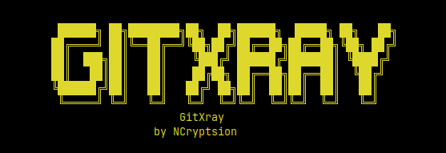
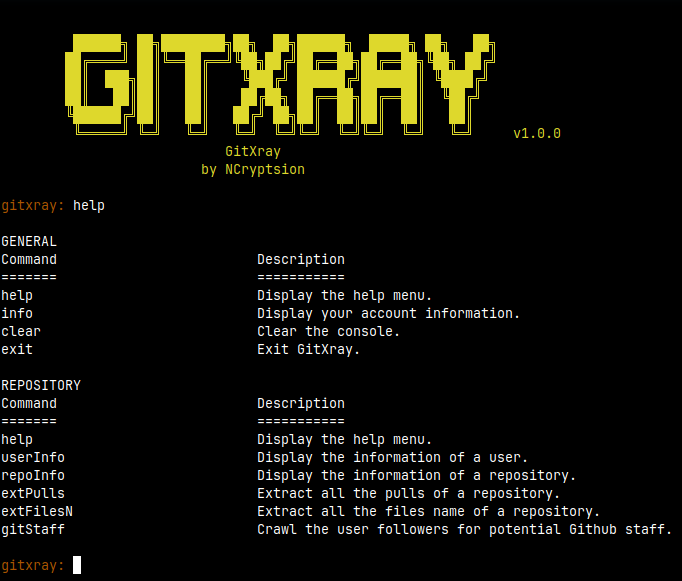

<div align="center"></div>

# Gitxray
Framework for GitHub that simplifies API utilization.

# ⚙️ Installations
## Github
```
git clone https://github.com/ncryptsion/gitxray.git
```

## NpmJS
```
npm install
```

## PNPM
```
pnpm install
```

# 🛠️ Setup
You only need your Github account personal token to use GitXray. Please [click me](https://www.youtube.com/watch?v=0C-B6bFuQYU) for tutorial.

# 🚀 Usage
```
node index.js
```

# 📸 Screenshot


<div align="center">
  <sub>This project is distributed under <a href="/LICENSE"><b>MIT License</b></a></sub>
</div>